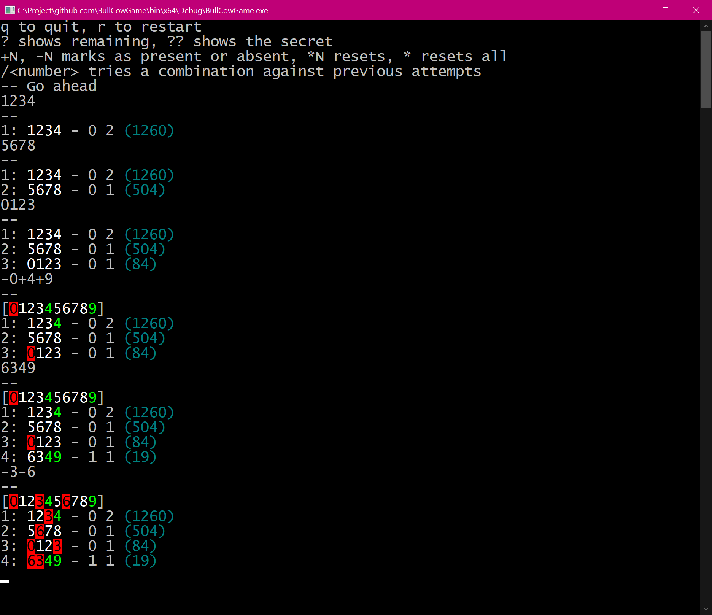
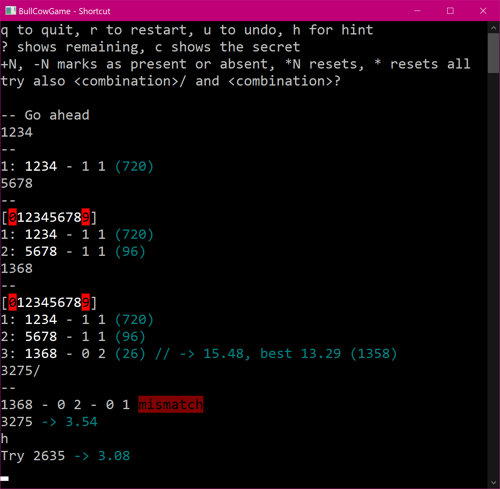

# Bulls & Cows

A tiny console impelmentation of [Bulls & Cows](https://en.wikipedia.org/wiki/Bulls_and_Cows) game, with a bit of self-help.

You see number of combinations remained, you can mark digits as oresumably absent or present with colorization, you can check your attempt before actually pushing it.

If you're good enough, I suppose you will be close to six attempts. 

Now this is so good that if are an addict, you would lose interest in wasting time! Otherwise this will teach you play better.

For example, `1368` makes sense, but `1358` would have been a slightly better move there (the fact that `1` and `5` are at the same first position has non-zero chance to pay you back).
